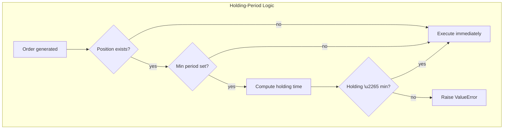

# Backtesting Engine

At runtime the **EventBus** orchestrates the data flow between:  
1. Data sources → provide market data.  
2. Strategy → consumes data & produces orders.  
3. Execution simulator → turns orders into fills.  

The `BacktestRunner` wires these pieces and produces a `BacktestResult`.

```python
from quantex.backtest import BacktestRunner
from quantex.sources import ParquetDataSource
from quantex.execution import NextBarSimulator
from my_strategy import SMACross

ds = ParquetDataSource("btc.parquet", symbol="BTC-USD")
strategy = SMACross(symbols=["BTC-USD"], initial_cash=10_000)

# Add commission to your backtest
simulator = NextBarSimulator(strategy.portfolio, commission=1.00)
result = BacktestRunner(strategy, {"btc": ds}, simulator=simulator).run()
print(result.metrics)
```

## BacktestResult Fields
| Field | Type | Description |
|-------|------|-------------|
| `nav` | `pd.Series` | Net-asset-value over time. |
| `orders` | `list[Order]` | All generated orders. |
| `fills` | `list[Fill]` | Executed trades. |
| `metrics` | `dict` | Performance metrics (see below). |

## Performance Metrics
The `metrics` dictionary contains key performance statistics:

| Metric | Description |
|--------|-------------|
| `total_return` | Total return as a percentage (e.g., 0.15 = 15% return) |
| `max_drawdown` | Maximum drawdown as a percentage (e.g., -0.25 = 25% drawdown) |
| `sharpe_ratio` | Annualised Sharpe ratio (sample st-dev, ddof=1) |
| `cagr` | Compounded annual growth rate |
| `volatility_annualised` | Annualised volatility of portfolio returns |
| `sortino_ratio` | Annualised Sortino ratio (downside deviation) |
| `calmar_ratio` | Calmar ratio – CAGR divided by absolute max drawdown |
| `buy_hold_return` | Buy-and-hold return of the first symbol (if applicable) |

```python
# Example accessing metrics
result = BacktestRunner(strategy, data_sources).run()
print(f"Total Return: {result.metrics['total_return']:.2%}")
print(f"Max Drawdown: {result.metrics['max_drawdown']:.2%}")
print(f"Sharpe Ratio: {result.metrics['sharpe_ratio']:.4f}")
```

> Extend by post-processing the `nav` or `fills` lists.

## Commission & Transaction Costs

Include realistic transaction costs in your backtests using the `simulator` parameter:

```python
from quantex.execution import NextBarSimulator

# Fixed commission per trade
simulator = NextBarSimulator(portfolio, commission=1.00)
result = BacktestRunner(strategy, data_sources, simulator=simulator).run()

# Analyze commission impact
total_commission = sum(fill.commission for fill in result.fills)
print(f"Total commission paid: ${total_commission:.2f}")
print(f"Number of trades: {len(result.fills)}")
```

**Commission Models:**
- **Fixed**: Flat fee per trade (e.g., $1.00 per trade)
- **Percentage**: Based on trade value (e.g., 0.1% of trade size)  
- **Tiered**: Different rates based on trade size
- **Custom**: Implement your own commission logic

Commission is automatically deducted from portfolio cash and included in performance calculations. 

## Minimum Holding Period

Some mandates impose a *minimum trade duration* (e.g. positions must stay open for at least one day).  
Pass a `pd.Timedelta` via the `min_holding_period` argument of `BacktestRunner` to enforce this rule at the execution layer:

```python
import pandas as pd
from quantex.backtest import BacktestRunner

# Require each position to be held for at least one trading day
min_period = pd.Timedelta(days=1)

runner = BacktestRunner(
    strategy,
    data_sources,
    min_holding_period=min_period,
)
result = runner.run()
```

Under the hood the `ImmediateFillSimulator` blocks any order that would *reduce, close or flip* an existing position before the period elapses and raises a `ValueError` with a clear message.  
If `min_holding_period` is `None` (default) the behaviour is unchanged.



### Example — SMA Crossover Strategy
Below is a **complete runnable example** using the built-in `min_holding_period`.  
While the engine will raise an error if you violate the rule, it is good practice to **guard inside the strategy** so that you only send compliant orders.

```python
import pandas as pd
import numpy as np
from quantex.strategy import Strategy
from quantex.sources import CSVDataSource
from quantex.backtest import BacktestRunner

class SMACross(Strategy):
    """Very small SMA-cross strategy (fast=20, slow=50)."""

    def run(self):
        # Fetch 50-bar lookback prices for the traded symbol
        px = self.get_lookback_prices(50)["close"]
        if len(px) < 50:
            return

        fast = px[-20:].mean()
        slow = px.mean()

        # Generate signals
        pos = self.positions["AAPL"]
        if fast > slow and pos.is_closed:
            self.buy("AAPL", 10)
        elif fast < slow and pos.is_long:
            # Guard: honour minimum holding period before attempting to close
            min_period = pd.Timedelta(days=1)
            if pos.open_timestamp is not None and self.timestamp - pos.open_timestamp >= min_period:
                self.close_position("AAPL")
            # else: wait until holding period satisfied

# --- Setup data & run ---
prices_csv = "aapl_1min.csv"  # must contain timestamp + OHLCV columns
source = CSVDataSource(prices_csv, symbol="AAPL")

min_period = pd.Timedelta(days=1)  # enforce 1-day hold
strategy = SMACross({"src": source}, symbols=["AAPL"], initial_cash=1_000_000)

runner = BacktestRunner(strategy, {"src": source}, min_holding_period=min_period)
result = runner.run()
print(result.metrics)
```

If the strategy attempts to flip or close the AAPL position inside 1 day, the engine raises:
```
ValueError: Order violates minimum holding period: held for 0:25:00, required 1 day 0:00:00.
``` 