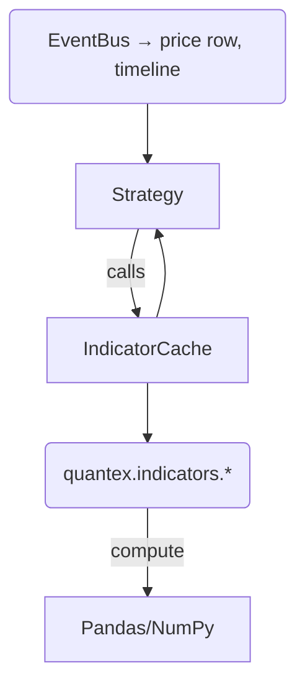

# Technical Indicators

Quantex ships with a growing **library of pure-Pandas indicator functions** that you can mix-and-match inside any strategy.

---

## 1. Quick-start

```python
from quantex.indicators import sma, rsi
import pandas as pd

# DataFrame with a `close` column (can be price history or your own)
df = pd.read_csv("prices.csv")

# Add two new columns in one line each
# 20-bar Simple Moving Average
# 14-bar Relative Strength Index

df["sma_20"] = sma(df["close"], period=20)
df["rsi_14"] = rsi(df["close"], period=14)
```

All indicator functions **preserve the original index** and never mutate your input series.

---

## 2. Inside a Strategy

The `Strategy` base class exposes a helper method `indicator()` that computes and *caches* values automatically.

```python
from quantex.strategy import Strategy

class SMACross(Strategy):
    fast = 10
    slow = 30

    def run(self):
        if self.index < self.slow:  # warm-up guard
            return

        fast_val = self.indicator("sma", "AAPL", period=self.fast)
        slow_val = self.indicator("sma", "AAPL", period=self.slow)

        price = self.get_price("AAPL")

        # Golden cross
        if fast_val > slow_val and self.positions["AAPL"].is_closed:
            self.buy("AAPL")
        # Death cross
        elif fast_val < slow_val and self.positions["AAPL"].is_long:
            self.sell("AAPL")
```

Behind the scenes Quantex:

1. Looks up the `sma` function in `quantex.indicators`.
2. Computes **the entire series once** the first time you call it.
3. Stores the result in a per-strategy cache keyed by `(name, symbol, params)`.
4. Returns only the latest value for the current bar, so you can work with scalars.

This means subsequent calls during the simulation are **O(1)** regardless of look-back length.

---

## 3. Indicator palette (MVP)

| Category      | Function             | Signature                                        |
| ------------- | -------------------- | ------------------------------------------------ |
| Trend         | `sma`                | `sma(series, period=20)`                         |
|               | `ema`                | `ema(series, period=20, adjust=False)`           |
| Momentum      | `rsi`                | `rsi(series, period=14)`                         |
| Volatility    | `bollinger_bands`    | `bollinger_bands(series, period=20, std_dev=2)`  |

Each function lives at `quantex.indicators.<name>`.

Future releases will add **MACD, ATR, Stochastic, CCI, VWAP, Donchian channels**, and more. Custom indicators can be added by simply creating a function that accepts a `pd.Series` and returns a `pd.Series`; place it in your own module and import it in your strategy.

---

## 4. Mermaid overview



---

## 5. Performance tips

* Prefer numeric NumPy dtypes (float64) – object dtype slows down rolling ops.
* Don’t over-request: if you only need the latest value use `indicator()`; computing the full Series repeatedly is wasteful.
* For very long histories (>5 M rows) consider installing **TA-Lib** and swapping implementations; Quantex will detect and use vectorised C routines automatically in future versions.

---

## 6. Reference API

All indicator functions follow this pattern:

```python
def indicator_name(series: pd.Series, *args, **kwargs) -> pd.Series:
    """Docs with parameter explanation."""
```

### Error handling

* A `ValueError` is raised for invalid periods or parameters (e.g. `period <= 0`).
* If not enough history is available the result contains `NaN` until the window is filled.

Read the docstrings (`help(quantex.indicators.sma)`) for full details. 