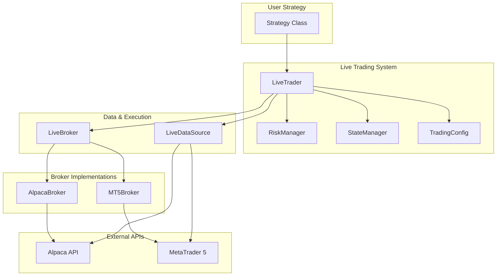

# Quantex Live Trading System Design

## Executive Summary

This document outlines the design for a comprehensive live trading system for the quantex library. The system will enable users to deploy their backtested strategies to live markets with minimal code changes, supporting both Alpaca (stocks/ETFs) and MetaTrader (forex/CFDs) brokers.

**Key Design Principles:**
1. **Strategy Compatibility**: Use the same Strategy class for both backtesting and live trading
2. **Easy Mode Switching**: Simple configuration change to switch between paper/live trading
3. **Safety First**: Built-in risk management with circuit breakers and position limits
4. **Reliability**: State persistence for crash recovery and graceful error handling
5. **Extensibility**: Plugin architecture for adding new broker integrations

---

## Architecture Overview



---

## Core Components

### 1. LiveDataSource

**Purpose**: Stream real-time market data and maintain historical buffer for indicator calculations.

**Key Challenge**: Indicators in `init()` need historical data (warmup period), but live data arrives incrementally.

**Solution**:
```python
class LiveDataSource(DataSource):
    def __init__(
        self,
        symbol: str,
        broker: LiveBroker,
        warmup_bars: int = 100,  # Historical bars to fetch on startup
        timeframe: str = "1Min"
    ):
        # 1. Fetch historical data for warmup period
        # 2. Start real-time streaming
        # 3. Maintain circular buffer of data

    def on_bar(self, bar: Bar):
        """Called when new bar arrives from broker."""
        # Append to buffer
        # Notify LiveTrader to call strategy.next()
```

**Features**:
- Fetches historical data on startup for indicator warmup
- Maintains compatibility with existing DataSource interface
- WebSocket integration for real-time updates
- Automatic reconnection on connection loss

---

### 2. LiveBroker (Abstract Base Class)

**Purpose**: Abstract interface for broker-specific implementations.

```python
from abc import ABC, abstractmethod
from typing import Optional
import numpy as np

class LiveBroker(ABC):
    """Abstract base class for live broker integrations."""

    def __init__(self, config: TradingConfig):
        self.config = config
        self.position: float = 0.0
        self.cash: float = 0.0
        self.equity: float = 0.0

    @abstractmethod
    def connect(self) -> bool:
        """Establish connection to broker."""
        pass

    @abstractmethod
    def disconnect(self):
        """Close broker connection."""
        pass

    @abstractmethod
    def get_account_info(self) -> dict:
        """Get account balance, equity, buying power."""
        pass

    @abstractmethod
    def submit_order(
        self,
        symbol: str,
        side: OrderSide,
        quantity: float,
        order_type: OrderType = OrderType.MARKET,
        limit_price: Optional[float] = None,
        stop_loss: Optional[float] = None,
        take_profit: Optional[float] = None
    ) -> Order:
        """Submit order to broker."""
        pass

    @abstractmethod
    def cancel_order(self, order_id: str) -> bool:
        """Cancel pending order."""
        pass

    @abstractmethod
    def get_position(self, symbol: str) -> Position:
        """Get current position for symbol."""
        pass

    @abstractmethod
    def get_historical_bars(
        self,
        symbol: str,
        timeframe: str,
        limit: int
    ) -> pd.DataFrame:
        """Get historical bars for warmup period."""
        pass

    @abstractmethod
    def subscribe_bars(self, symbol: str, callback: Callable):
        """Subscribe to real-time bar updates."""
        pass
```

---

### 3. AlpacaBroker (Implementation)

**Purpose**: Alpaca Markets integration for stocks, ETFs, and options.

**Dependencies**: `alpaca-py` (official SDK)

```python
class AlpacaBroker(LiveBroker):
    """
    Alpaca Markets broker implementation.
    Supports paper and live trading modes.
    """

    def __init__(
        self,
        api_key: str,
        secret_key: str,
        paper: bool = True,  # Default to paper trading
        base_url: Optional[str] = None
    ):
        from alpaca.trading.client import TradingClient
        from alpaca.data.live import StockDataStream

        self.trading_client = TradingClient(
            api_key=api_key,
            secret_key=secret_key,
            paper=paper
        )
        self.data_stream = None

    def connect(self) -> bool:
        # Verify API credentials
        account = self.trading_client.get_account()
        return account.status == "ACTIVE"

    def submit_order(self, symbol, side, quantity, **kwargs) -> Order:
        from alpaca.trading.requests import MarketOrderRequest

        order_request = MarketOrderRequest(
            symbol=symbol,
            qty=quantity,
            side=side,
            time_in_force="day"
        )
        alpaca_order = self.trading_client.submit_order(order_request)
        return self._convert_order(alpaca_order)
```

**Paper vs Live Switching**:
```python
# Paper trading (default)
broker = AlpacaBroker(
    api_key="YOUR_KEY",
    secret_key="YOUR_SECRET",
    paper=True
)

# Live trading - just change one parameter!
broker = AlpacaBroker(
    api_key="YOUR_KEY",
    secret_key="YOUR_SECRET",
    paper=False  # Live mode
)
```

---

### 4. MetaTrader5Broker (Implementation)

**Purpose**: MetaTrader 5 integration for forex, CFDs, and futures.

**Dependencies**: `MetaTrader5` (official Python package)

```python
class MetaTrader5Broker(LiveBroker):
    """
    MetaTrader 5 broker implementation.
    Requires MT5 terminal to be running.
    """

    def __init__(
        self,
        server: str,
        login: int,
        password: str,
        path: Optional[str] = None
    ):
        import MetaTrader5 as mt5
        self.mt5 = mt5
        self.server = server
        self.login = login
        self.password = password
        self.path = path

    def connect(self) -> bool:
        if not self.mt5.initialize(path=self.path):
            return False
        return self.mt5.login(self.login, self.password, self.server)

    def submit_order(self, symbol, side, quantity, **kwargs) -> Order:
        # Convert to MT5 order format
        request = {
            "action": self.mt5.TRADE_ACTION_DEAL,
            "symbol": symbol,
            "volume": quantity,
            "type": self.mt5.ORDER_TYPE_BUY if side == OrderSide.BUY else self.mt5.ORDER_TYPE_SELL,
            "price": self.mt5.symbol_info_tick(symbol).ask,
            "deviation": 10,
            "magic": 234000,  # Strategy identifier
            "comment": "quantex_live",
            "type_time": self.mt5.ORDER_TIME_GTC,
            "type_filling": self.mt5.ORDER_FILLING_IOC,
        }
        result = self.mt5.order_send(request)
        return self._convert_order(result)
```

---

### 5. LiveTrader (Orchestration Engine)

**Purpose**: Main orchestrator that runs the live trading loop.

```python
class LiveTrader:
    """
    Live trading engine that runs a strategy against real market data.
    """

    def __init__(
        self,
        strategy: Strategy,
        config: TradingConfig,
        risk_manager: Optional[RiskManager] = None,
        state_manager: Optional[StateManager] = None
    ):
        self.strategy = strategy
        self.config = config
        self.risk_manager = risk_manager or RiskManager()
        self.state_manager = state_manager or StateManager()
        self.running = False

    def run(self):
        """Main live trading loop."""
        try:
            self._initialize()
            self._main_loop()
        except KeyboardInterrupt:
            self._shutdown("User interrupted")
        except Exception as e:
            self._shutdown(f"Error: {e}")
            raise

    def _initialize(self):
        """Setup before trading starts."""
        # 1. Load previous state if exists
        state = self.state_manager.load()

        # 2. Connect to broker
        for symbol, broker in self.strategy.positions.items():
            if isinstance(broker, LiveBroker):
                broker.connect()

        # 3. Initialize data sources with warmup
        for symbol, data_source in self.strategy.data.items():
            if isinstance(data_source, LiveDataSource):
                data_source.warmup()

        # 4. Call strategy init (indicators are calculated here)
        self.strategy.init()

        # 5. Verify risk limits
        self.risk_manager.verify_initial_state(self.strategy)

        self.running = True

    def _main_loop(self):
        """Event-driven main loop."""
        while self.running:
            # Wait for bar updates from all data sources
            # This is event-driven via callbacks, not polling
            pass

    def on_bar(self, symbol: str, bar: Bar):
        """Called when new bar arrives."""
        # 1. Update data source
        data_source = self.strategy.data[symbol]
        data_source.add_bar(bar)

        # 2. Check risk limits BEFORE strategy executes
        if not self.risk_manager.check_limits(self.strategy):
            self._shutdown("Risk limit triggered")
            return

        # 3. Execute strategy logic
        self.strategy.next()

        # 4. Process any orders created by strategy
        self._process_orders(symbol)

        # 5. Save state
        self.state_manager.save(self.strategy)

    def _process_orders(self, symbol: str):
        """Execute orders placed by strategy."""
        broker = self.strategy.positions[symbol]
        # Orders are now processed by LiveBroker directly
        # Strategy's buy()/sell() calls are intercepted
```

---

### 6. RiskManager

**Purpose**: Safety controls to prevent catastrophic losses.

```python
@dataclass
class RiskLimits:
    """Risk management configuration."""
    max_daily_loss: float = 0.05  # 5% of account
    max_position_size: float = 0.25  # 25% of equity per position
    max_positions: int = 5  # Maximum concurrent positions
    max_drawdown: float = 0.10  # 10% max drawdown
    trading_hours_start: time = time(9, 30)  # Market open
    trading_hours_end: time = time(16, 0)  # Market close
    disable_over_weekend: bool = True

class RiskManager:
    """
    Monitors trading activity and enforces risk limits.
    """

    def __init__(self, limits: RiskLimits = None):
        self.limits = limits or RiskLimits()
        self.daily_pnl = 0.0
        self.peak_equity = 0.0
        self.circuit_breaker_triggered = False

    def check_limits(self, strategy: Strategy) -> bool:
        """
        Check if proposed trade violates risk limits.
        Called before every strategy.next() call.
        """
        if self.circuit_breaker_triggered:
            return False

        # Check trading hours
        if not self._is_trading_hours():
            return False

        # Check daily loss limit
        if self.daily_pnl < -self.limits.max_daily_loss * self.peak_equity:
            self.trigger_circuit_breaker("Daily loss limit exceeded")
            return False

        # Check drawdown
        current_equity = self._calculate_equity(strategy)
        if current_equity > self.peak_equity:
            self.peak_equity = current_equity

        drawdown = (self.peak_equity - current_equity) / self.peak_equity
        if drawdown > self.limits.max_drawdown:
            self.trigger_circuit_breaker("Max drawdown exceeded")
            return False

        return True

    def trigger_circuit_breaker(self, reason: str):
        """Stop all trading activity."""
        self.circuit_breaker_triggered = True
        logger.critical(f"CIRCUIT BREAKER TRIGGERED: {reason}")
        # TODO: Send notification (email, Slack, etc.)

    def verify_position_size(self, symbol: str, quantity: float, equity: float) -> bool:
        """Check if position size is within limits."""
        position_value = quantity * self._get_price(symbol)
        return position_value <= self.limits.max_position_size * equity
```

---

### 7. TradingConfig

**Purpose**: Centralized configuration for all trading parameters.

```python
@dataclass
class TradingConfig:
    """
    Configuration for live trading.
    """
    # Mode
    paper_trading: bool = True  # Default to paper trading

    # Broker credentials (can also use environment variables)
    alpaca_api_key: Optional[str] = None
    alpaca_secret_key: Optional[str] = None

    # MT5 credentials
    mt5_server: Optional[str] = None
    mt5_login: Optional[int] = None
    mt5_password: Optional[str] = None

    # Data settings
    warmup_bars: int = 100
    timeframe: str = "1Min"

    # Risk settings
    risk_limits: RiskLimits = field(default_factory=RiskLimits)

    # State management
    state_file: str = "trading_state.json"
    save_interval: int = 60  # Save state every 60 seconds

    # Logging
    log_level: str = "INFO"
    log_file: Optional[str] = "live_trading.log"

    @classmethod
    def from_env(cls) -> "TradingConfig":
        """Load configuration from environment variables."""
        return cls(
            alpaca_api_key=os.getenv("ALPACA_API_KEY"),
            alpaca_secret_key=os.getenv("ALPACA_SECRET_KEY"),
            paper_trading=os.getenv("PAPER_TRADING", "true").lower() == "true",
        )

    @classmethod
    def from_yaml(cls, path: str) -> "TradingConfig":
        """Load configuration from YAML file."""
        import yaml
        with open(path) as f:
            data = yaml.safe_load(f)
        return cls(**data)
```

---

### 8. StateManager

**Purpose**: Persist trading state for crash recovery.

```python
class StateManager:
    """
    Manages persistence of trading state.
    Enables recovery from crashes without losing position information.
    """

    def __init__(self, state_file: str = "trading_state.json"):
        self.state_file = state_file

    def save(self, strategy: Strategy):
        """Save current trading state to disk."""
        state = {
            "timestamp": datetime.now().isoformat(),
            "positions": {
                symbol: {
                    "position": broker.position,
                    "avg_price": broker.position_avg_price,
                    "cash": broker.cash,
                }
                for symbol, broker in strategy.positions.items()
            },
            "indicators": [
                # Save indicator state if needed
            ]
        }
        with open(self.state_file, "w") as f:
            json.dump(state, f, indent=2)

    def load(self) -> Optional[dict]:
        """Load previous trading state."""
        if not os.path.exists(self.state_file):
            return None
        with open(self.state_file) as f:
            return json.load(f)

    def restore_state(self, strategy: Strategy):
        """Restore strategy state from saved file."""
        state = self.load()
        if state is None:
            return

        for symbol, pos_data in state["positions"].items():
            if symbol in strategy.positions:
                broker = strategy.positions[symbol]
                broker.position = pos_data["position"]
                broker.position_avg_price = pos_data["avg_price"]
                broker.cash = pos_data["cash"]
```

---

## User Workflow

### Step 1: Create Strategy (Same as Backtesting)

```python
from quantex import Strategy
import numpy as np

class MovingAverageCrossover(Strategy):
    fast_period = 10
    slow_period = 30

    def init(self):
        close = self.data["AAPL"].Close
        self.sma_fast = self.Indicator(
            pd.Series(close).rolling(self.fast_period).mean().to_numpy()
        )
        self.sma_slow = self.Indicator(
            pd.Series(close).rolling(self.slow_period).mean().to_numpy()
        )

    def next(self):
        if len(self.data["AAPL"].Close) < self.slow_period:
            return

        if self.sma_fast[-1] > self.sma_slow[-1] and self.sma_fast[-2] <= self.sma_slow[-2]:
            self.positions["AAPL"].buy(quantity=0.5)
        elif self.sma_fast[-1] < self.sma_slow[-1] and self.sma_fast[-2] >= self.sma_slow[-2]:
            self.positions["AAPL"].sell(quantity=0.5)
```

### Step 2: Backtest (Existing Workflow)

```python
from quantex import SimpleBacktester, CSVDataSource

# Backtest
source = CSVDataSource("AAPL.csv")
strategy = MovingAverageCrossover()
strategy.add_data(source, "AAPL")

bt = SimpleBacktester(strategy, cash=10_000)
report = bt.run()
print(f"Backtest Return: {report.total_return:.2%}")
```

### Step 3: Deploy Live (New)

```python
from quantex import LiveTrader, LiveDataSource, TradingConfig
from quantex.brokers import AlpacaBroker

# Create strategy (same as backtest)
strategy = MovingAverageCrossover()

# Configure for paper trading (safe testing)
config = TradingConfig(
    paper_trading=True,  # Start with paper trading!
    alpaca_api_key="YOUR_KEY",
    alpaca_secret_key="YOUR_SECRET",
    warmup_bars=100,
    timeframe="1Min",
)

# Create broker
broker = AlpacaBroker(
    api_key=config.alpaca_api_key,
    secret_key=config.alpaca_secret_key,
    paper=config.paper_trading
)

# Create live data source (auto-fetches warmup data)
data_source = LiveDataSource(
    symbol="AAPL",
    broker=broker,
    warmup_bars=config.warmup_bars,
    timeframe=config.timeframe
)

# Add to strategy (same interface as backtest)
strategy.add_data(data_source, "AAPL")

# Create and run live trader
live_trader = LiveTrader(strategy, config)

print("Starting live trading... Press Ctrl+C to stop")
live_trader.run()
```

### Step 4: Switch to Live Trading (One Line Change)

```python
# After verifying paper trading works...
config = TradingConfig(
    paper_trading=False,  # <-- Just change this to False!
    alpaca_api_key="YOUR_KEY",
    alpaca_secret_key="YOUR_SECRET",
)
# ... rest of code stays the same
```

---

## Project Structure

```
src/quantex/
├── __init__.py
├── strategy.py              # Existing (unchanged)
├── datasource.py            # Existing (unchanged)
├── indicators.py            # Existing (unchanged)
├── backtester/              # Existing (unchanged)
├── broker/
│   ├── __init__.py
│   ├── broker.py            # Existing backtest broker
│   └── types.py             # Existing order types
├── live/                    # NEW: Live trading module
│   ├── __init__.py
│   ├── trader.py            # LiveTrader orchestration
│   ├── datasource.py        # LiveDataSource
│   ├── config.py            # TradingConfig
│   ├── risk.py              # RiskManager
│   ├── state.py             # StateManager
│   └── brokers/
│       ├── __init__.py
│       ├── base.py          # LiveBroker ABC
│       ├── alpaca.py        # AlpacaBroker
│       └── mt5.py           # MetaTrader5Broker
└── helpers.py               # Existing
```

---

## Implementation Phases

### Phase 1: Core Infrastructure
- [ ] `LiveBroker` abstract base class
- [ ] `TradingConfig` dataclass
- [ ] `RiskManager` with basic limits
- [ ] `StateManager` for persistence

### Phase 2: Alpaca Integration
- [ ] `AlpacaBroker` implementation
- [ ] `AlpacaDataSource` with WebSocket streaming
- [ ] Historical data fetch for warmup
- [ ] Paper trading testing

### Phase 3: LiveTrader Engine
- [ ] Event-driven main loop
- [ ] Order execution pipeline
- [ ] Error handling and reconnection
- [ ] Logging and monitoring

### Phase 4: MetaTrader 5
- [ ] `MetaTrader5Broker` implementation
- [ ] MT5 data source
- [ ] Documentation and examples

### Phase 5: Advanced Features
- [ ] Web dashboard for monitoring
- [ ] Email/Slack notifications
- [ ] Performance analytics
- [ ] Multi-strategy support

---

## Safety Considerations

### 1. Default to Paper Trading
All examples and documentation should default to `paper_trading=True`. Users must explicitly opt-in to live trading.

### 2. Circuit Breakers
Hard stops that cannot be overridden:
- Daily loss limit
- Maximum drawdown
- Connection loss timeout
- Order rejection rate threshold

### 3. Position Verification
Before submitting orders:
- Verify symbol is tradable
- Check sufficient buying power
- Validate position size limits
- Confirm market is open

### 4. Audit Logging
All actions logged with timestamps:
- Order submissions
- Position changes
- Risk limit checks
- Connection events

---

## Dependencies

New dependencies to add to `pyproject.toml`:

```toml
[project]
dependencies = [
    # ... existing dependencies ...
    "alpaca-py>=0.8.0",        # Alpaca trading
    "MetaTrader5>=5.0.37",     # MT5 integration (optional)
    "websockets>=11.0",        # WebSocket support
    "schedule>=1.2.0",         # Scheduling utilities
]

[project.optional-dependencies]
live = ["alpaca-py", "websockets"]
mt5 = ["MetaTrader5"]
```

---

## Configuration Example (YAML)

```yaml
# trading_config.yaml
paper_trading: true

# Alpaca credentials (can also use env vars)
alpaca_api_key: ${ALPACA_API_KEY}
alpaca_secret_key: ${ALPACA_SECRET_KEY}

# Data settings
warmup_bars: 100
timeframe: "1Min"

# Risk management
risk_limits:
  max_daily_loss: 0.05
  max_position_size: 0.25
  max_positions: 5
  max_drawdown: 0.10
  trading_hours_start: "09:30"
  trading_hours_end: "16:00"
  disable_over_weekend: true

# State management
state_file: "my_strategy_state.json"
save_interval: 60

# Notifications (optional)
notifications:
  email:
    smtp_server: "smtp.gmail.com"
    smtp_port: 587
    username: ${EMAIL_USER}
    password: ${EMAIL_PASS}
    to: "trader@example.com"
  slack:
    webhook_url: ${SLACK_WEBHOOK}
```

---

## Conclusion

This design provides:

1. **Minimal Learning Curve**: Users use the same Strategy class they already know
2. **Safety by Default**: Paper trading is the default; explicit opt-in for live
3. **Robustness**: State persistence and circuit breakers protect against crashes
4. **Extensibility**: Easy to add new broker integrations
5. **Production Ready**: Risk management and monitoring built-in

The key insight is that the `Strategy` class interface (`init()` and `next()`) remains unchanged. The differences between backtesting and live trading are encapsulated in the data source and broker implementations, which users configure once when setting up the live trader.
